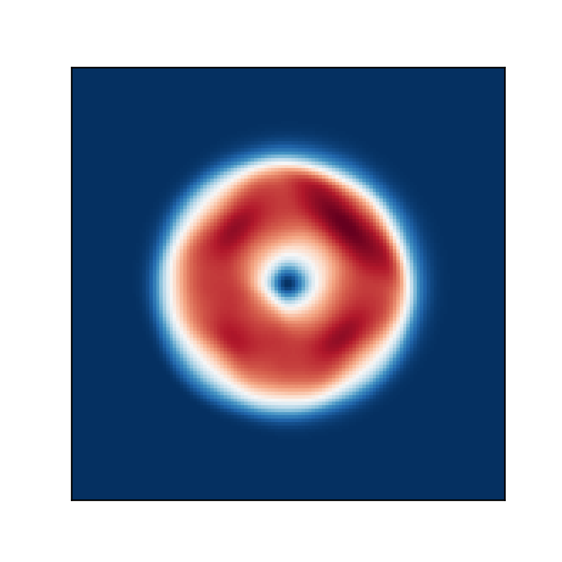

# constrainedtransport-python
Finite Volume Constrained Transport simulation of the Orszag-Tang vortex

## Create Your Own Constrained Transport Magnetohydrodynamics Simulation (With Python)

### Philip Mocz (2023), [@PMocz](https://twitter.com/PMocz)

Modified by Chang-Goo Kim [@changgoo](http://changgoo.github.io) to simulate the Field Loop advection test presented in
[Gardiner & Stone (2005)](https://ui.adsabs.harvard.edu/abs/2005JCoPh.205..509G/abstract).


```
python constrainedtransport.py
```


